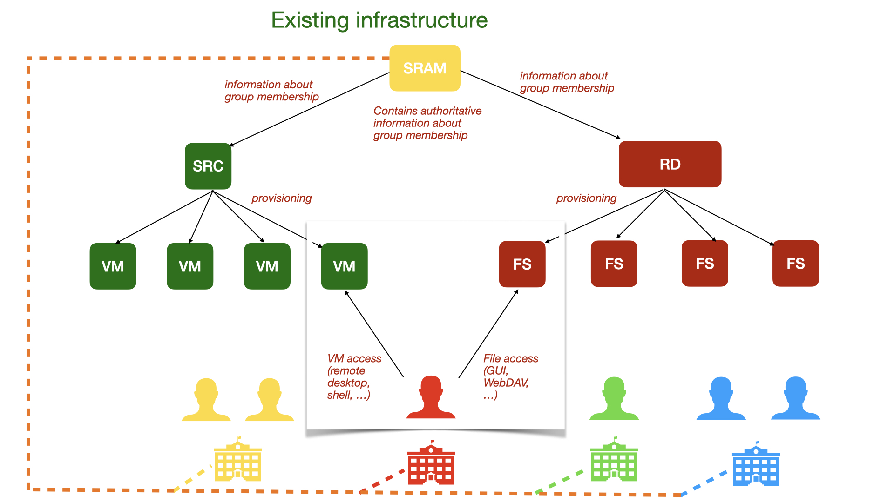

# SURF token-based access project

Abbreviations:
* AS: Authorisation Server (in OAuth and in general)
* GUI: Graphical User Interface
* RD: SURF Research Drive (a service that provisions file servers including GUI)
* RS: Resource Server (in OAuth)
* SURF: The ICT cooperation of Dutch research and education institutes
* SRAM: SURF Research Access Management
* SRC: SURF Research Cloud (a service that provisions virtual machines)
* VM: Virtual Machine
 
## Report of phase 1
Ponder Source was asked to look into the possibilities for establishing token-based access between SURF Research Cloud (SRC) in the role of client, SURF Research Drive (RD) in the role of resource server, leveraging the position of SURF Reseach Access Management (SRAM) in the role of authorisation server.

### Initial problem statement

Given the following existing infrastructure:

Researchers from various institutes come together in a Collaborative Organisation ("CO" in SRAM terms), to work on a science project together. They use Virtual Machines ("VMs") which are provisioned through SURF Research Cloud ("SRC"). The researchers will then want to establish both read and write access between some of the VMs and some of the files from Research Drive instances they have access to.

A naive way to achieve this is if the researcher puts their own WebDAV credentials into the VM. The downside of this is that everybody who can access the VM can then also access all files on this researcher's entire Research Drive account.

We want to investigate if we can do better, giving out a scopes access token by which the code running on the VM can only access for instance one folder on the researcher's VM.

We want the solution to benefit from the fact that SRAM connects multiple services, and could define access policies on the basis of the group membership information it already contains. This way, not each resource providing service needs to set up its own authorization server, and a many-to-many matrix between various resource providing and resource receiving services within the eco system can be avoided.

We want the solution to sit somewhere in-between a full enterprise-style setup where nothing gets provisioned unless the central administration agrees, and a fully open system where functionality and group membership information is duplicated many times.

### The tricky part

We realised that most existing OAuth implementations benefit from a tight coupling and shared domain knowledge between the authorisation server and the resource server. For instance, when interacting with the GUI of the authorisation server for GitHub, one sees a list of one's own GitHub repositories to include or exclude. There is a "backdoor" through which the GitHub AS and the GitHub RS can talk to each other, and they do so in a GitHub-specific way.

In the case of giving access to a Research Drive (RD) resource, we would like the user to select a folder from a file system tree viewer. And maybe this file system viewer even has specific icons for some RD-specific attributes of folders, that don't make sense when selecting a folder on iRods, or a time series from an oscillograph, etc. The user will need to go through some domain-specific interactions in order to precisely select which resource to share. Therefore, it seems appropriate that the scope selection somehow happens on the GUI of the RS instead of in the client or on the AS.

### Initial Attempt: Federated Group Shares
In the meetings on 17 January, 3 April and 7 July 2023 we came up with a potential solution for this problem.

Whereas OAuth generally starts the user journey at the client, there are other mechanisms, such as when you share a photo from the Gallery app of your smartphone, or [Open Cloud Mesh](https://github.com/cs3org/OCM-API), where the user journey starts in the GUI of the RS.

RD already has a "federated group shares" features where users can share a file or folder with an SRAM-defined group of people.

Our initial idea was, whenever a VM is assigned to a group of people, simply mount all the shared folders for that group into the VM.

In July, we started to implement a WebDAV endpoint to plug into RD as a proof-of-concept for this. However, after some discussion we concluded that this solution would not be generic enough, and we decided to abandon this initial attempt.

### Solution Design

After abandoning this initial attempt, we decided to:
1) define a few more specific use cases,
2) create a swimlanes diagram and a clickable demo of how the flow could work, using SRAM as the authorisation server but having a domain-specific GUI on RD for selecting the exact resource to share, and
3) research whether there are any existing protocols or protocol extensions that can already support what we need.

#### Use cases

#### Flow

#### Protocols