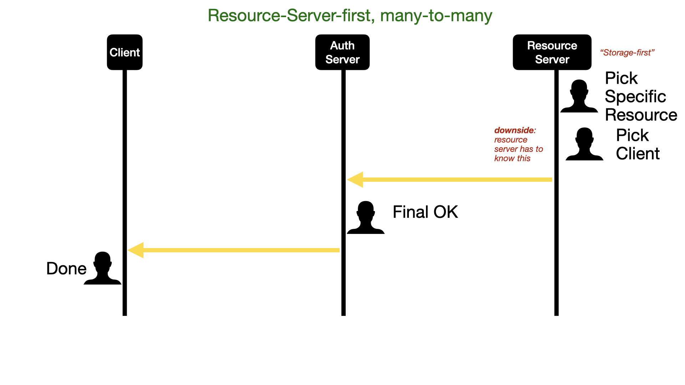
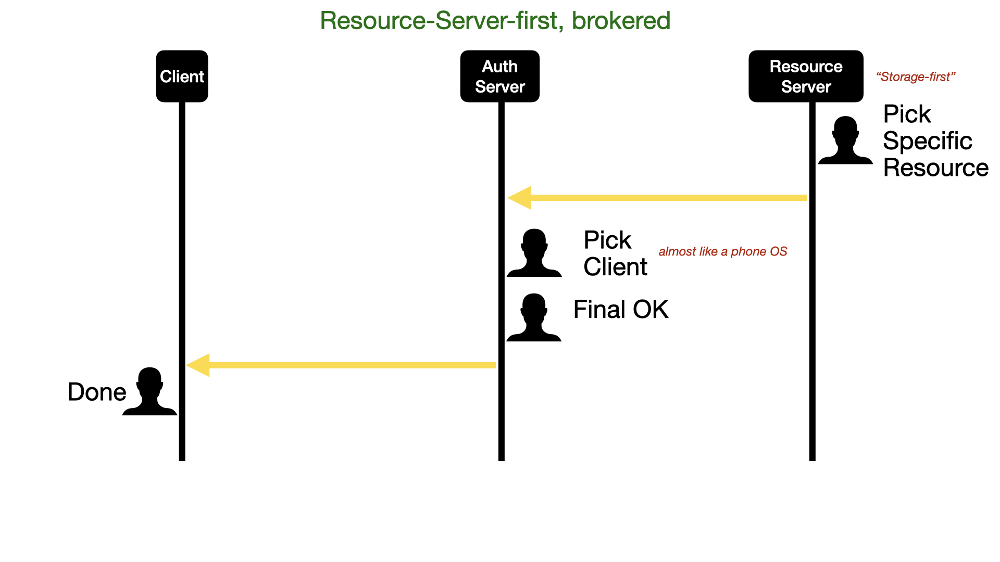
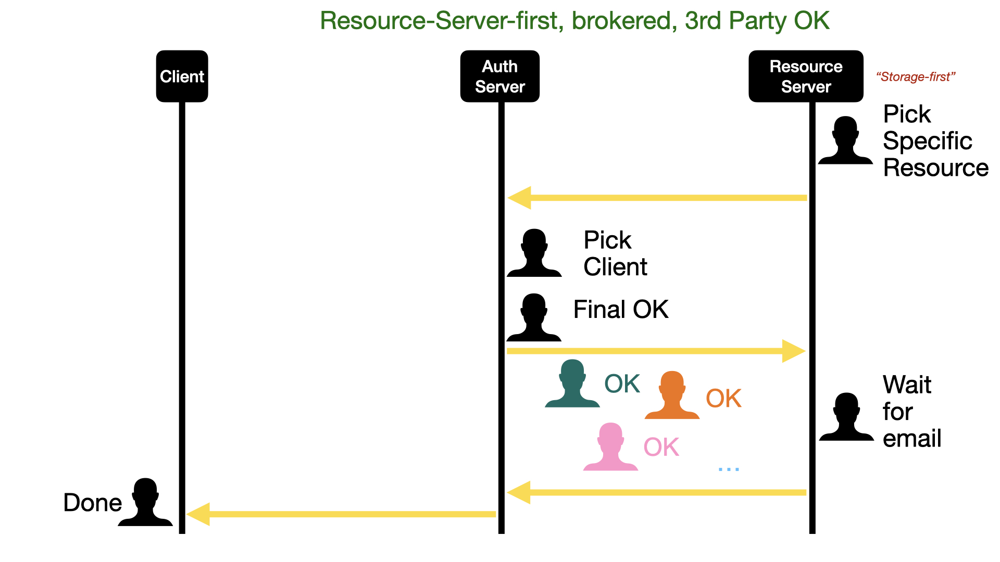
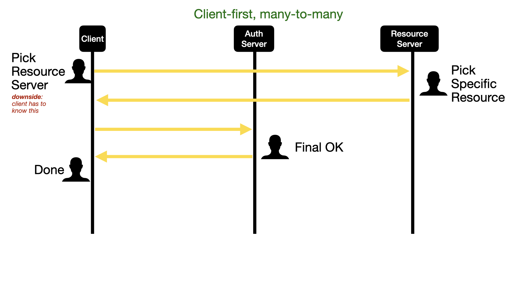
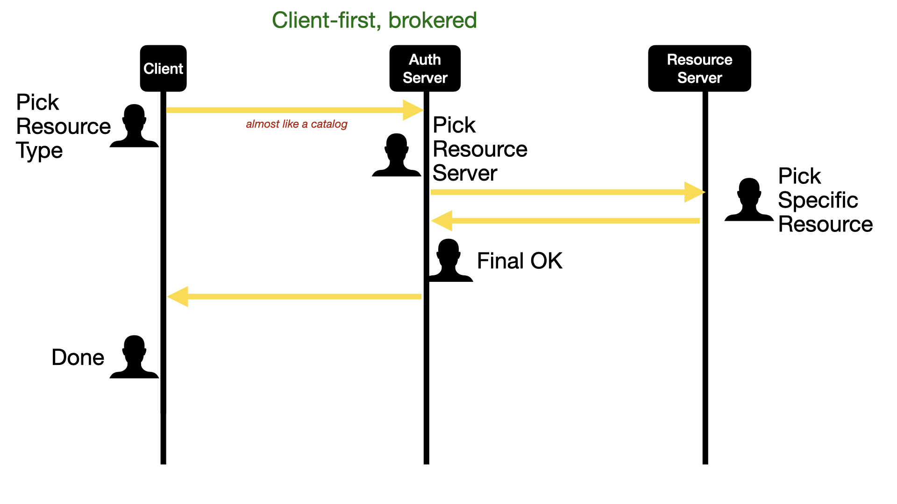
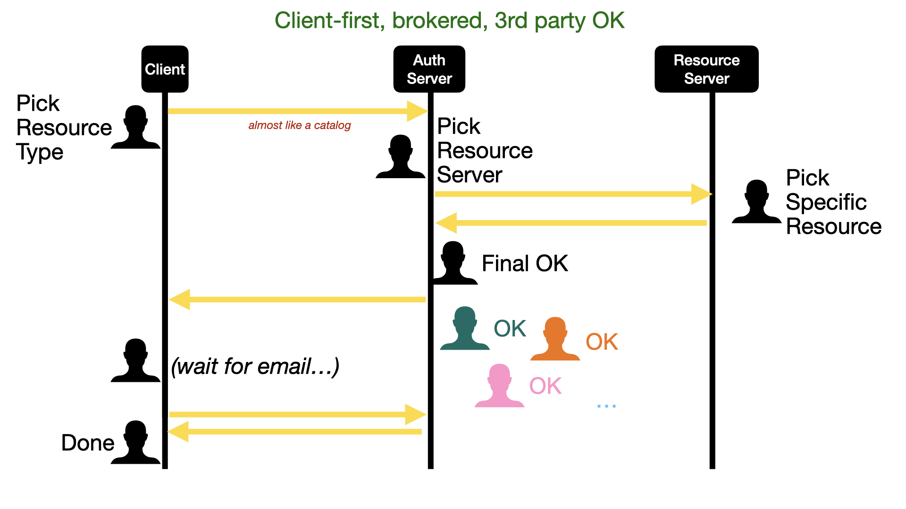

# SURF token-based access project

Abbreviations:
* AS: Authorisation Server (in OAuth and in general)
* GUI: Graphical User Interface
* RD: SURF Research Drive (a service that provisions file servers including GUI)
* RS: Resource Server (in OAuth)
* SURF: The ICT cooperation of Dutch research and education institutes
* SRAM: SURF Research Access Management
* SRC: SURF Research Cloud (a service that provisions virtual machines)
* SSK: SURF Share Kit
* VM: Virtual Machine
 
## Report of phase 1
Ponder Source was asked to look into the possibilities for establishing token-based access between SURF Research Cloud (SRC) in the role of client, SURF Research Drive (RD) in the role of resource server, leveraging the position of SURF Reseach Access Management (SRAM) in the role of authorisation server.

### Initial problem statement

Given the following existing infrastructure:

Researchers from various institutes come together in a Collaborative Organisation ("CO" in SRAM terms), to work on a science project together. They use Virtual Machines ("VMs") which are provisioned through SURF Research Cloud ("SRC"). The researchers will then want to establish both read and write access between some of the VMs and some of the files from Research Drive instances they have access to.

A naive way to achieve this is if the researcher puts their own WebDAV credentials into the VM. The downside of this is that everybody who can access the VM can then also access all files on this researcher's entire Research Drive account.

We want to investigate if we can do better, giving out a scopes access token by which the code running on the VM can only access for instance one folder on the researcher's VM.

We want the solution to benefit from the fact that SRAM connects multiple services, and could define access policies on the basis of the group membership information it already contains. This way, not each resource providing service needs to set up its own authorization server, and a many-to-many matrix between various resource providing and resource receiving services within the eco system can be avoided.

We want the solution to sit somewhere in-between a full enterprise-style setup where nothing gets provisioned unless the central administration agrees, and a fully open system where functionality and group membership information is duplicated many times.

### The tricky part

We realised that most existing OAuth implementations benefit from a tight coupling and shared domain knowledge between the authorisation server and the resource server. For instance, when interacting with the GUI of the authorisation server for GitHub, one sees a list of one's own GitHub repositories to include or exclude. There is a "backdoor" through which the GitHub AS and the GitHub RS can talk to each other, and they do so in a GitHub-specific way.

In the case of giving access to a Research Drive (RD) resource, we would like the user to select a folder from a file system tree viewer. And maybe this file system viewer even has specific icons for some RD-specific attributes of folders, that don't make sense when selecting a folder on iRods, or a time series from an oscillograph, etc. The user will need to go through some domain-specific interactions in order to precisely select which resource to share. Therefore, it seems appropriate that the scope selection somehow happens on the GUI of the RS instead of in the client or on the AS.

### Initial Attempt: Federated Group Shares
In the meetings on 17 January, 3 April and 7 July 2023 we came up with a potential solution for this problem.

Whereas OAuth generally starts the user journey at the client, there are other mechanisms, such as when you share a photo from the Gallery app of your smartphone, or [Open Cloud Mesh](https://github.com/cs3org/OCM-API), where the user journey starts in the GUI of the RS.

RD already has a "federated group shares" features where users can share a file or folder with an SRAM-defined group of people.

Our initial idea was, whenever a VM is assigned to a group of people, simply mount all the shared folders for that group into the VM.

In July, we started to implement a WebDAV endpoint to plug into RD as a proof-of-concept for this. However, after some discussion we concluded that this solution would not be generic enough, and we decided to abandon this initial attempt.

### Solution Design

After abandoning this initial attempt, we decided to:
1) define a few more specific use cases,
2) create a swimlanes diagram and a clickable demo of how the flow could work, using SRAM as the authorisation server but having a domain-specific GUI on RD for selecting the exact resource to share, and
3) research whether there are any existing protocols or protocol extensions that can already support what we need.

#### Use cases
We will consider use cases for mounting a folder from Research Drive (RD) into SURF Resarch Cloud (SRC), and for publishing a folder from Research Drive to SURF Sharekit (SSK).
We assume there is a single user who has access to the folder through their RD account, using the GUI. This means it's either a subfolder of their account, or a folder that was shared with them. In both
cases it will be visible in the folder tree in the Files app inside the Research Drive GUI.

The user is a member of several COs. In all use cases, they want to share this particular folder via the context of one of the CO's they are a member of.

In the case of SSK, the sharing will be read-only. In the case of SRC it might be read-only or read-write.

Use case 1: Sharing a folder to SSK

Use case 2: Sharing a folder read-only to a particular SRC VM

Use case 3: Sharing a folder read-write to a particular SRC VM

A policy could apply that states that the VM to share with needs to belong to the CO of which the user is a member.
We assume that once a folder is mounted into a VM, all users who have access to this VM also have access to this folder.
There is no way to share a folder with only one particular VM user. We make this assumption because VM users will in general have sudo / root access, so they could read/write any file on the whole VM.

When the SRC VM is set up, policies can be defined which restrict who is allowed to share folders with it. In general we assume the VM belongs to a CO and only CO members are allowed to share folders with it, but other policies should also be possible.

From RD it is already allowed to share a folder with anyone in the world, so it doesn't make sense to restrict this to certain VMs unless that general policy is also tightened.

The setting up of the VM is a separate process from the sharing of a folder, but the policies that are defined during VM setup will affect the sharing process.
For sharing with SSK we are still waiting for more input to refine that use case further.

#### Flow

We assume the user(s) involved click through a number of redirecting screens, getting good information at each step, and without hitting dead ends.
We considered various flows, in two broad categories: starting from RD (the resource server) or starting from SRC/SKK (the client).

##### Resource Server First
If the resource server knows which clients exist, it can already ask the user who to share with. This is a familiar flow for RD users, since it's how Open Cloud Mesh already works for sharing documents with local, remote and mixed groups of users.

To make it a little bit easier, we can decouple the market of resource servers from the market of clients, putting a broker in the middle. This has a number of advantages: Each resource server only has to trust the broker, not many clients. Each client, at the same time, also only needs to trust the broker instead of individual resource servers. This avoids duplication of information and of infrastructure. It also, organisationally, makes the job of resource server operators and of client operators easier, because they can outsource the headache of managing who they share with. This model has been successful for many other cases such as eduroam and edugain, and an NREN like SURF is very well positioned to offer a broker like this.

This can also be compared with how a smartphone OS may serve a "Share" dialog, to which a photo gallery app can pass a photo, and from which a messaging app can consume a shared photo, without the gallery app and the messaging app being aware of each other's existence.

The idea of a two-sided broker is also in line with EU thinking about data spaces (IDSA, DSSC, SiMPL, EOSC, iShare, Gaia-X, etc).

Rather than requiring the full policy of what may be shared when with whom for all situations ahead of time, a "3rd party OK" is also a very useful tool to allow low-threshold decisions and review. For instance, in general, a researcher may prepare a whole set of operations and have it ready to be put into action as soon as a budget holder or department head gives the green light.

##### Client First
In OAuth, all flows start at the client, and not at the resource server. We don't really know why this is, but it does make the flow feel more natural, because the end point (where you have the shared resource at the place where you want it and can start using it) coincides with the starting point.

And again, adding the broker in the middle.

And again, adding third-party OK.

We decided to go with the client-first brokered flow. This is also what we used for the [clickable demo](https://pondersource.github.io/surf-token-based-access/phase-1/clickable-demo/) which we developed as part of the conversation for this milestone.

#### Protocols
##### structured scopes
We looked into protocols we could find in the Open Cloud Mesh (OCM) context and didn't get very far, since OCM is not really gated and also not brokered. From the start we have also looked at OAuth and new developments there such as UMA and GNAP. Especially Intent Lodging (transactions and structured scopes) looks like a useful component for this, because the AS doesn't understand precisely what the user selected in the RS GUI. Normally the client would first talk to the RS to create the transaction details, but we will probably want this to be brokered too. That's something to explore in the phase 2 milestone of this project.

##### AS chaining
We also see a use for how one AS might redirect to another, and come back. This is something Géant are already exploring as well to deal with federated situations, where for instance a Dutch auth server needs to relay to a Danish auth server to check the details of some RS that is operated under Danish supervision, but to which a Dutch researcher gets access as part of a collaborative organisation.

##### Scopes gathering
Where UMA interacts with a client to negotiate claims gathering we want the AS to redirect the user to the RS to negotiate scopes gathering. The user would be redirected back to the AS once the transaction has been defined. This could follow the same mechanism as AS chaining.
We didn't find any prior art for yet, so we will try to contact Justin Richer for advice, and explore this further in phase 2 of this project.